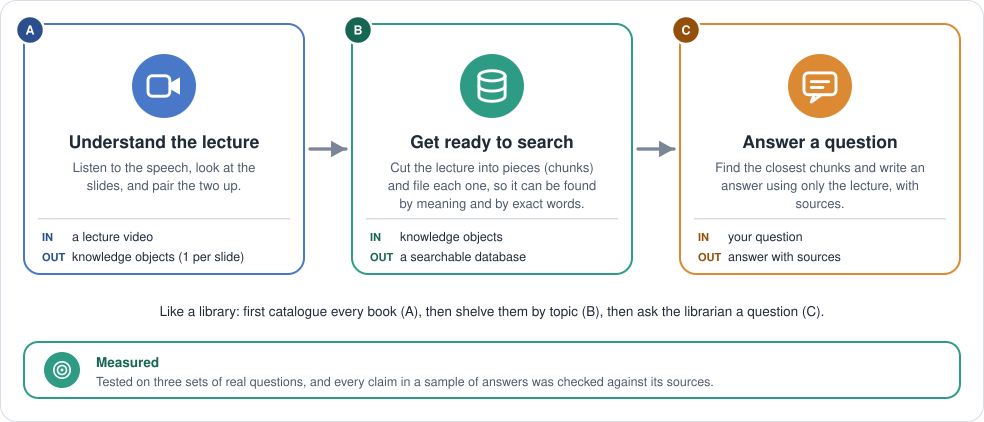
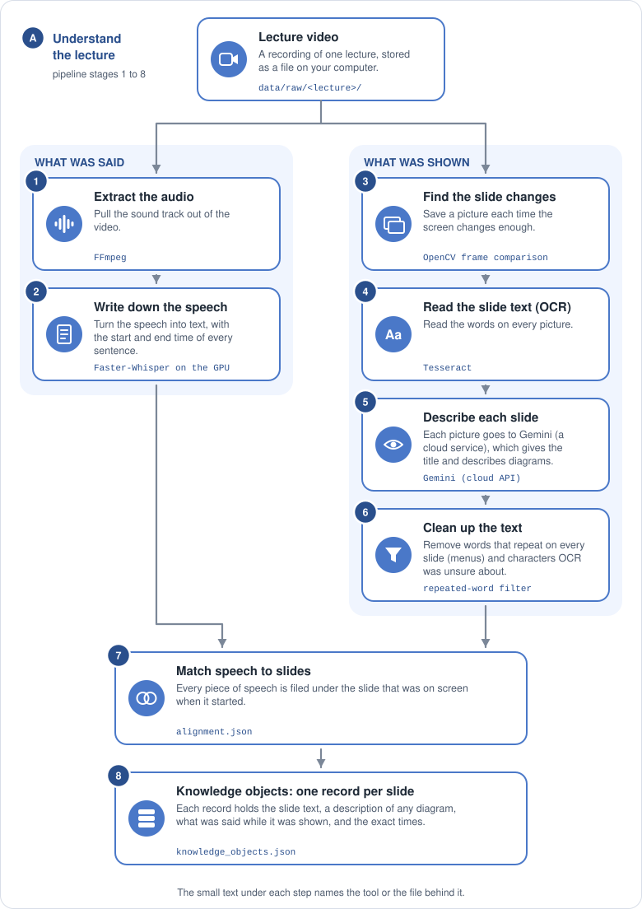

# multimodalRAG-course-assistant

A learning project: an assistant that understands a whole university course (lecture videos, slides, PDFs) and answers questions using only that material, with a citation to the lecture, the slide and the moment in the video.

I'm building it one stage at a time and writing down why I made each choice. The reasoning and the measured results are in [`docs/`](docs/).

## How it works



1. **Understand the lecture.** A lecture video is turned into one record per slide: what was on the slide, what was said while it was shown, and exact times (Phase 1, [diagram](docs/diagrams/phase1.svg)).
2. **Get ready to search.** The lecture is cut into pieces of about 350 words, and every piece is stored in a small local database by its meaning (Phase 2, [diagram](docs/diagrams/phase2.svg)).
3. **Answer a question.** The pieces closest in meaning to the question are found, a language model writes an answer from those pieces only, and each source is shown with its lecture, time range and slide titles ([one question, step by step](docs/diagrams/one-question.svg)).

## Status

**Phase 1 is complete: a lecture video becomes structured, timestamped knowledge.** It has been run on three lectures of two different kinds (annotated slides with a webcam overlay, and a screen recording of live coding). An exit check, `python -m src.verify --all`, passes on all three: every piece of speech is matched to the slide on screen, and no speech is lost.

**Phase 2 has a working prototype (2026-10-08): chunking, embeddings, a vector database, search, and answers with citations.** All three lectures are indexed (96 chunks), and `python -m src.ask "your question"` answers from them. Two private evaluation sets (they stay private, because the questions come from course material) measure it. On a first, easier set of 11 questions, the right place is first for 10 and in the top 3 for all 11. On a harder set of 36 (paraphrased questions, decoy passages that share the question's terms, questions that need two places, and the code lecture), it is first for 21 and in the top 3 for 30. All 7 questions the lectures do not cover are refused, and a claim-by-claim check of the 36 harder answers found no invented claim. These are baselines from small sets, not proof of quality ([decision 24](docs/decisions.md), [decision 25](docs/decisions.md)). Comparing the settings, keyword search, reranking and the comparison of embedding models are still planned. The design and progress are in [`docs/phase2-plan.md`](docs/phase2-plan.md).

## What the pipeline does



```
video --> audio --> transcript (speech with timestamps) -----------------.
  |                                                                      v
  '--> keyframes --> OCR --> vision model --> text cleanup -------> align --> knowledge objects
       (one picture   (text)   (figures, code,    (remove interface    (which slide    (one record per slide:
        per slide)               title, slide no.)  and garbage text)    was showing?)   slide + speech + times)
```

1. **Audio:** FFmpeg extracts the sound track.
2. **Transcript:** Faster-Whisper turns speech into text with timestamps.
3. **Keyframes:** OpenCV finds the moments where the screen changes and saves a picture of each.
4. **OCR:** Tesseract reads the text on each picture.
5. **Vision:** a vision model (Gemini, free tier) describes figures and code, and returns the title and slide number, using a fixed reply form.
6. **Clean:** interface text (menus) and low-confidence garbage are removed from the OCR text.
7. **Align:** each piece of speech is matched to the slide that was on screen.
8. **Knowledge objects:** one JSON record per slide, with its text, description, speech and exact start and end times.
9. **Chunk:** the speech is cut into chunks of about 350 words, each with the slides shown meanwhile and its exact times.
10. **Index:** each chunk is turned into 1,024 numbers by an embedding model (bge-m3, on the GPU) and stored in Qdrant, an embedded vector database, next to its times and slide titles.

Then, for every question:


- **Search** (`python -m src.search`): the question is turned into numbers by the same model, and Qdrant returns the five chunks whose numbers are closest.
- **Answer** (`python -m src.ask`): Gemini gets those five chunks as numbered excerpts and may only answer from them. It cites excerpt numbers, never times. My code checks the numbers and builds the source list from the stored chunk data, so a source can't be invented.

Every stage reads files and writes files, so each result can be opened and checked. How each stage works, and why, is in [`docs/architecture.md`](docs/architecture.md).

## Results so far

Phase 1, on three lectures:

| | Length | Keyframes | Words in transcript = knowledge objects |
|---|---|---|---|
| Lecture 1: annotated slides, webcam overlay | 88 min | 64 | 11,194 |
| Lecture 2: same style | 92 min | 67 | 11,192 |
| Lecture 3: public code screencast | 51 min | 73 | 10,051 |

A lecture takes about 10 minutes end to end on a laptop GPU. The vision stage is limited by the free API quota (15 requests per minute).

Phase 2, chunking and indexing:

| | Chunks | Words of speech per chunk (smallest / median / largest) |
|---|---|---|
| Lecture 1 | 33 | 295 / 356 / 367 |
| Lecture 2 | 33 | 139 / 353 / 360 |
| Lecture 3 | 30 | 244 / 356 / 370 |

All 96 chunks are embedded and stored (2.1 MB). Measured details, and a mistake I made with the embedding model's input limit, are in [`docs/decisions.md`](docs/decisions.md).

Phase 2, the first evaluation of the search (meaning search only, default settings, best 10 chunks over all three lectures). A result counts as a hit when it comes from the right lecture and overlaps the time where the answer is spoken:

| Questions | Count | hit@1 | hit@3 | MRR |
|---|---|---|---|---|
| With an answer in the lectures | 11 | 0.91 | 1.00 | 0.939 |
| Not covered by the lectures | 3 | refused 3 of 3 | | |

The answer step cited a chunk from the right place in all 11 answers. With only 11 questions and answer ranges that are often many minutes long, this is a baseline to compare changes against, not a claim that the search is good. How it was measured, and what it does not show, is in [decision 24](docs/decisions.md).

Phase 2, a harder set (36 questions with an answer, written in a student's wording, with tight answer ranges):

| Set | Questions | hit@1 | hit@3 | hit@10 | MRR |
|---|---|---|---|---|---|
| First, easier set | 11 | 0.91 | 1.00 | 1.00 | 0.939 |
| Harder set | 36 | 0.58 | 0.83 | 0.94 | 0.711 |

Decoy questions, where a look-alike passage shares the question's terms, are the weakest: the first result is right for 0.44 of them. On this set all 4 questions the lectures do not cover were refused, and 33 of 36 answers cite the right place. Those are the 33 where the right chunk was in the top 5, which is all the answer step reads, so better search is what improves the answers. A claim-by-claim check found 116 of 123 claims supported by the cited excerpt, 5 supported by an excerpt that was not cited, 2 overstated, and none unsupported. How the set was built and checked is in [decision 25](docs/decisions.md).

## Setup

You need Python 3.11, [FFmpeg](https://ffmpeg.org/) and [Tesseract](https://github.com/tesseract-ocr/tesseract) installed, and a free Gemini API key from [Google AI Studio](https://aistudio.google.com/).

```
pip install -r requirements.txt
```

On Windows, pip installs a CPU-only PyTorch. For the GPU, install the CUDA build first:

```
pip install torch --index-url https://download.pytorch.org/whl/cu128
```

Copy `.env.example` to `.env` and fill in `GEMINI_API_KEY` (and `TESSERACT_CMD` if Tesseract is not on your PATH). Speech recognition is currently set to run on an NVIDIA GPU, which also needs the cuBLAS and cuDNN libraries on the PATH. Running without a GPU needs a small change in `src/processing/speech.py`. The first time the embedding model runs, it downloads about 2 GB.

## Running it

Put one video in `data/raw/<lecture_name>/`, then from the project root:

```
python -m src.pipeline lecture_01                  # one lecture, all ten stages
python -m src.pipeline --all                       # every folder in data/raw/
python -m src.pipeline lecture_01 --force vision   # redo a stage
```

Results appear in `data/processed/<lecture_name>/`: `knowledge_objects.json` from Phase 1 and `chunks.json` from stage 9. The vectors go into `data/qdrant/`. Finished stages are skipped, so running again is quick. Only one program can have `data/qdrant/` open at a time.

Search and ask, after at least one lecture is indexed:

```
python -m src.search "What is a confusion matrix?"                  # the five closest chunks
python -m src.search "What is a confusion matrix?" --lecture lecture_01 --top 3
python -m src.ask "What is a confusion matrix?"                     # an answer with sources
```

The shape of an answer (the wording here is only an illustration):

```
Question: What is a confusion matrix?

A confusion matrix counts the four ways a classifier can be right or wrong. [1][2]

Sources:
[1] lecture_01 | 12:31 - 15:06 | <slide titles>
     slide image: data/processed/lecture_01/keyframes/<frame>.jpg
[2] lecture_01 | 14:58 - 18:03 | <slide titles>
     slide image: data/processed/lecture_01/keyframes/<frame>.jpg
```

If the lectures do not cover the question, the answer says so and shows the closest passages the search found.

To measure the search on your own set of questions (a JSON file, by default `data/eval/retrieval_eval.json`; mine stay private):

```
python -m src.evaluate                  # search only: hit@k and MRR, nothing is sent to Gemini
python -m src.evaluate --answers        # also writes an answer for every question (one Gemini call each)
python -m src.evaluate --eval-file path/to/other_questions.json
```

Each run is saved in `data/eval/` with the settings it used, so two runs can be compared.

To check a finished lecture, or look up what was on screen and said at any second:

```
python -m src.verify lecture_01                # is everything complete and consistent?
python -m src.verify lecture_01 --at 1420      # what was shown and said at 23:40?
```

A lecture can have its own settings in an optional `data/raw/<lecture_name>/settings.json` (for example, a code screencast needs different slide-change settings than a slide deck). See [`docs/architecture.md`](docs/architecture.md).

## Tests

```
python -m pytest
```

179 tests run in about 6 seconds, with no video, no embedding model, no database folder and no API calls.

## Repository layout

```
src/
  pipeline.py          runs all stages for one lecture or all lectures
  config.py            settings and defaults
  lecture_settings.py  per-lecture settings.json
  verify.py            the exit check (Phase 1 files and chunks)
  search.py            command: the five closest chunks for a question
  ask.py               command: a cited answer to a question
  evaluate.py          command: measure the search on a set of questions with known answers
  ingestion/           audio extraction
  processing/          speech, keyframes, OCR, vision, cleanup, alignment, knowledge objects, chunking
  embeddings/          turning text into vectors (with a disk cache)
  database/            the Qdrant store and the indexing stage
  retrieval/           from a question to the closest chunks
  generation/          the answer step: prompt, citation check, sources
  schemas/             the data shapes passed between stages
tests/                 automated tests
docs/                  architecture notes, decision log, roadmap, Phase 2 plan
docs/diagrams/         the diagrams above (SVG) and the script that draws them
```

## Limits to know about

- **Search quality is measured on small sets:** 11 questions, and a harder set of 36 (decisions 24 and 25). The answer places and reference answers come from independent passes that I have not each checked by hand. The harder set separates settings much better, but 36 questions is still small, and there are only 3 that need two places. Chunk size, which slide text is embedded, and the choice of embedding model are the settings I will compare.
- Only lecture video is processed so far. PDFs and PowerPoint files are planned.
- Whisper runs on an NVIDIA GPU as configured, and the embedding model also uses the GPU (about 2.7 GB at peak; never run both at once on a 6 GB card).
- OCR is weak on terminal and code text, so for code the vision model's text is the useful source.
- The answer step sends the chunk text to Gemini, so those passages leave the machine. The slide pictures are not sent.
- Course material is copyrighted, so no lecture videos, slides, transcripts, images or evaluation questions are in this repository. The `data/` folder is ignored by git.

## Documentation

- [`docs/architecture.md`](docs/architecture.md): how each stage works, in the order the data flows
- [`docs/decisions.md`](docs/decisions.md): why I chose what I chose, with the numbers
- [`docs/phase2-plan.md`](docs/phase2-plan.md): the Phase 2 design and where it stands
- [`docs/roadmap.md`](docs/roadmap.md): what is done and what is next
- [`docs/diagrams/`](docs/diagrams/): the diagrams as SVG files, and `make_diagrams.py` to redraw them
