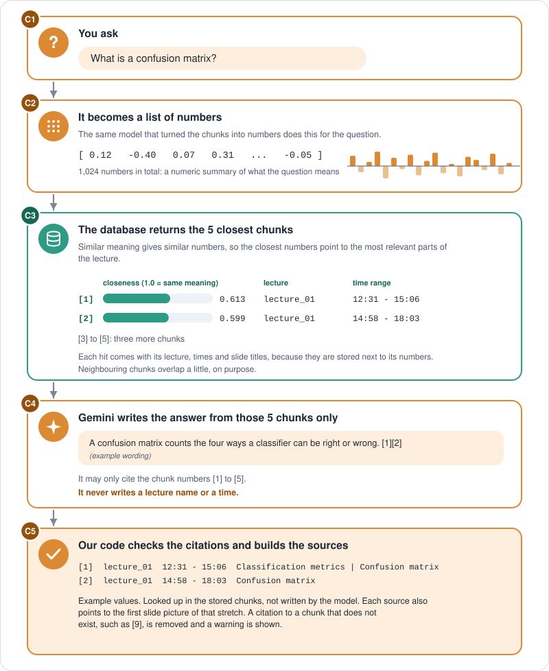

# How the pipeline works

These are my notes on how the pipeline works: what each stage does, how it does it, and why I built it that way. Phase 1 (stages 1 to 8) turns a lecture video into knowledge objects. Phase 2 (stages 9 and 10, and the search and answer commands) makes them searchable and answers questions from them. The reasoning behind the bigger choices, with numbers, is in [decisions.md](decisions.md). What is planned next is in [roadmap.md](roadmap.md) and [phase2-plan.md](phase2-plan.md).

Last updated: 2026-10-08 (Phase 1 complete, Phase 2 prototype working).

The diagrams in this document are SVG files in [`diagrams/`](diagrams/), drawn by `diagrams/make_diagrams.py`.

## What it does

One lecture video goes in. What comes out is a list of **knowledge objects**, one per slide shown: what was on the slide (text, and a description of any diagram or code), everything said while it was on screen, and exact start and end times. For any moment in the video, you can tell what was said and what was on screen.

```
lecture video
   |-- 1 audio ----> 2 transcript ----------------------------.
   |                  (speech with timestamps)                  |
   |                                                            v
   '-- 3 keyframes -> 4 ocr -> 5 vision -> 6 clean ------> 7 align -> 8 knowledge objects
        (one picture   (text)   (describe    (remove         (which slide    (one record per slide,
         per slide)             figures,     junk text)       was showing?)   with its speech)
                                code, title)
```

The same flow as a picture, with what each step produces:


Folder convention: the video goes in `data/raw/<lecture>/` (exactly one video file, otherwise the pipeline stops instead of guessing), and everything it produces goes in `data/processed/<lecture>/`. Both are ignored by git.

```
python -m src.pipeline lecture_01                      # one lecture
python -m src.pipeline --all                           # every lecture folder
python -m src.pipeline lecture_01 --force vision       # redo one stage (repeat the flag for several)
python -m src.pipeline lecture_01 --force ocr --force clean
```

Two rules apply to every stage:
- **Skip if the output exists**, unless forced. Transcription and frame extraction are slow, so this makes it practical to work on the later stages.
- **Build the whole output in memory, then write the file.** A crash can't leave a half-written file that the skip check would later trust.

Every stage reads files and writes files, so any stage's output is a JSON file I can open and read.

## Stage 1: audio (`src/ingestion/video_pipeline.py`)

`extract_audio` runs FFmpeg to pull the audio out of the video as a 16 kHz mono WAV file, which is the format Whisper wants. It calls FFmpeg through `subprocess` and does no audio work itself.

The WAV is only needed to make the transcript, and it is big (162 MB for an 88-minute lecture) but can be recreated in seconds. So the pipeline **skips this stage whenever `transcript.json` exists, and deletes `audio.wav` right after the transcript is written.** Forcing audio or transcript recreates it first. This is a config switch (`DELETE_AUDIO_AFTER_TRANSCRIPT`, on by default).

## Stage 2: transcript (`src/processing/speech.py`)

`transcribe` runs Faster-Whisper (the `small` model, on the GPU in float16) and writes `transcript.json`: a list of `{start, end, text}` segments. Every segment is checked against a schema (`TranscriptSegment`) before it is written.

Running on the GPU needs more than a GPU and a driver. It also needs the cuBLAS and cuDNN libraries, installed separately and on the PATH of the terminal session. The CPU mode worked without any of that and gave matching quality on a short test, so the GPU was a speed choice.

Speed: about 17 to 19 times real time (a 92-minute lecture in about 289 seconds).

## Stage 3: keyframes (`src/processing/keyframes.py`)

A lecture video has about 130,000 frames. I only want one picture per thing worth reading. `KeyframeExtractor` looks at the video every 5 seconds (it **seeks** to each time instead of decoding every frame, so an 88-minute video needs about 1,000 reads) and saves a frame when the screen has changed enough since the last *saved* frame.

`compute_difference` converts both frames to grayscale and returns the **fraction of pixels** that changed by more than `diff_threshold`. A new slide is saved when that fraction is above `change_area_threshold`, or when `max_gap_seconds` have passed with nothing saved.

**Why a fraction and not an average.** My first version averaged the pixel difference over the whole frame. The recording has a small webcam window that moves constantly, and it contaminated the average so much that no single threshold worked (25 keyframes, with a 21-minute gap). I considered cropping the webcam out by fixed pixel position and rejected it, because it would only fit that one layout. A fraction works wherever the overlay is: a small moving corner only ever changes a small share of the frame, while a real slide change changes a large share.

**Why the time-based safety net.** Live handwriting on a slide builds up over many seconds and may never cross the threshold in a single step, even though the change is real. Forcing a save after a long gap catches those. I checked that a fallback save really caught a meaningful moment (the presenter circling a formula), so it isn't hiding a weak detector.

**How I tuned it on the first lecture.** I printed the score at every checked frame and looked at real numbers. Raising the per-pixel threshold from 25 to 40 barely changed the plateau between transitions, which showed the plateau was real content (annotation) and not video noise. Lowering the area threshold from 0.10 to 0.05 dropped the share of saves coming from the safety net from about 59% to about 20%. The result was 64 keyframes for a 55-slide deck, and the extra ones are genuine revisits and progressive annotation states.

**The defaults are not universal.** They live in `config.py`, and a lecture can override them in its own `settings.json` (see "Per-lecture settings" below). A code screencast needed different values, because window switching and scrolling are large changes while typing is small: the defaults gave 156 keyframes for a 51-minute video, and `change_area_threshold` 0.15 with `max_gap_seconds` 90 gave 73.

## Stage 4: OCR (`src/processing/ocr.py`)

`extract_text` runs Tesseract on each keyframe and writes `visual_metadata.json`, one record per keyframe: `timestamp`, `image_path`, the raw `text` (one word per line), the average `confidence`, and a `word_confidences` list with one 0-to-1 number per word.

I chose Tesseract because it is classical OCR: nothing to host and no API cost. The weakness is that it reads everything on screen, so the application's menu bar lands in the text, handwriting becomes garbage words, and indentation in code is lost. Stages 5 and 6 deal with that.

`visual_metadata.json` is shared with the next two stages, which add fields to it. If OCR is redone with `--force ocr`, it keeps what the vision stage already stored, so redoing OCR costs no API calls.

## Stage 5: vision (`src/processing/vision.py`)

OCR can read words but not diagrams, plots or code layout. This stage sends every keyframe to Gemini (the `google-genai` library, free tier) and asks it to fill in a fixed form instead of writing free text:

| Field | Meaning |
|---|---|
| `title` | the slide's title, empty if none |
| `description` | for a figure: what it shows, including every label, axis title, annotation and caption. For code: the visible code with its indentation plus one line on what it does. Empty for a text-only frame. |
| `content_type` | `text_slide`, `title_slide`, `diagram`, `chart`, `code`, `equation` or `other` |
| `slide_number` | the page counter, only if the presentation program shows one |
| `clean_text` | all teaching text on screen, without menus or toolbars |

The reply is checked against a schema, so there is no sentence to string-match. `description` comes before `content_type` in the form on purpose: Gemini writes the fields in order, so it classifies after it has written what it sees. The prompt is generic: it says to ignore application interface and any small camera overlay, and it names no particular recording software. `description` empty means "nothing to describe", and `None` means "not done yet", so a rerun only retries what is missing.

**Speed is limited by the free-tier quota,** not by compute: 15 requests per minute per model. Extra parallel workers just got "429 quota exceeded" errors. So all requests share a limiter that spaces them evenly (14 per minute, a setting), with a small thread pool that only helps when the API is slow to answer. A 64-keyframe lecture takes about 5 minutes. Calls are retried up to four times with increasing waits, a failed keyframe is left as "not done" for the next run, and Ctrl+C saves the keyframes that already finished.

## Stage 6: clean (`src/processing/ocr_clean.py`)

This stage writes a new field, `cleaned_text`, and never changes the raw OCR text, so I can compare raw OCR, cleaned OCR and Gemini's `clean_text` fairly later. Two layers, because they catch different junk:

1. **Interface words.** Menu words such as `File Edit View Page Tools` are real words, so OCR reads them with *high* confidence, and a confidence filter can't see them. Instead I count how many keyframes each word appears on. Words on at least a quarter of the keyframes become candidates, and **one Gemini request per lecture** picks which candidates are software interface text. It can only choose from the candidates. The answer is saved as `junk_terms.json` so I can read it, and plain code then removes those words.
2. **Low confidence.** Garbage like `oP` or `sso` comes with a low confidence score, so words below a cutoff are dropped, and so are tokens with no letter or digit. The default cutoff is 0.3. Real code scores lower in Tesseract (`import` 0.49), so a code lecture overrides it to 0.1 in its settings file.

Measured against Gemini's own text on three lectures, cleaning raised the share of OCR words that Gemini also saw from 64% to 97% and from 71% to 92% on the two slide lectures, and from 46% to 58% on the code lecture. For code, Tesseract stays weak, and Gemini's text is the real source. The numbers and the limits are in [decision 11](decisions.md).

## Stage 7: align (`src/processing/alignment.py`)

The question: for this piece of speech, which slide was on screen? I sort the keyframes by time and use `bisect.bisect_right` on their timestamps, which finds the last keyframe at or before the segment's start in a binary search. Speech before the first keyframe gets `None`. The result is `alignment.json`.

**Limitation.** Only the segment's *start* time is used. A slide shown for a few seconds between two segment starts gets no speech. On the first lecture, 4 of 64 slides have an empty transcript, and I opened all four: three are quick section-title slides and one is a real content slide. They must not be dropped, because titles carry the topic. The plan is to merge blank slides into the next chunk in Phase 2.

## Stage 8: knowledge objects (`src/processing/knowledge.py`)

This merges `alignment.json` and `visual_metadata.json` into `knowledge_objects.json`: one object per keyframe with `lecture_id`, `start_timestamp`, `end_timestamp`, the joined `transcript`, `slide_text` (raw OCR), `slide_description`, `image_path`, `content_type`, `title` and `slide_number`. Fields are added only when a stage can fill them.

An illustrative object (made-up content, not from a real lecture):

```json
{
  "lecture_id": "lecture_01",
  "start_timestamp": 1160.0,
  "end_timestamp": 1285.0,
  "transcript": "So here we compare two models on the same test set ...",
  "slide_text": "Model comparison\nAccuracy ...",
  "slide_description": "A bar chart with two bars, one per model, ...",
  "image_path": "data/processed/lecture_01/keyframes/frame_1160.00.jpg",
  "content_type": "chart",
  "title": "Model comparison",
  "slide_number": 12
}
```

Details:
- A slide ends when the next one starts. The last slide ends when the last speech ends.
- Speech is grouped with one pass over the segments into a dictionary keyed by slide, and each slide then reads its own bucket. My first version looped over all segments once per slide. The output was identical, and at this scale the old loop would not have been slow, so I changed it for clarity, not speed.
- A missing description or content type becomes an empty string, so the schema validates.
- `lecture_id` is taken from the output folder name.
- Speech before the first slide is skipped.

**Check I use on every lecture:** each end time equals the next start time, and the word count in the knowledge objects equals the word count in `transcript.json`, so no speech is lost or duplicated.

## Phase 2 at a glance


Two flows share one database. **Getting ready** runs once per lecture, as stages 9 and 10 of the pipeline: the knowledge objects are cut into chunks, and each chunk is stored with its vector. **Answering** runs for every question: the question becomes a vector, the closest chunks are found, and a language model writes an answer from them. The next picture follows one question through the second flow, with example values:



## Stage 9: chunk (`src/processing/chunking.py`)

A slide is a poor thing to search for. In the first lecture the median slide has 162 words of speech, 26 of 64 slides have under 100 words, 8 have over 350, and a few have none. Searching per slide gives blurry matches for the long ones and useless tiny pieces for the short ones. A **chunk** is a piece of the lecture of about the same size, which remembers exactly which slides and which seconds it covers.

`build_chunks` works from two files: `alignment.json` (every speech piece, about 17 words each, with its exact start and end time) and `knowledge_objects.json` (the slide text). Picture the speech pieces on a conveyor belt and a bucket:

1. Drop the pieces into the bucket in time order.
2. When the bucket holds about 350 words, seal it. That is a chunk. The next bucket starts with a copy of the last piece of the sealed one (the overlap), so an idea that was cut in half appears in both chunks.
3. A piece is never added if it would push the bucket over 450 words.
4. A slide nobody spoke during, often a section title, waits and joins the next bucket, because a title comes before the content it names.
5. A last bucket with fewer than 100 new words is merged into the one before it, if the result still fits.

Only the speech decides where the cuts go, and the sizes are counted in words of speech. The slides the speech was spoken over are attached afterwards. So one chunk covers about three slides, and a long slide can be split over two chunks, which then both carry its text.

A chunk (`src/schemas/chunk.py`) has:

| Field | Meaning |
|---|---|
| `chunk_id` | lecture plus start second, for example `lecture_01_1074`, so building again gives the same ids |
| `lecture_id`, `course_id` | where it comes from |
| `start_timestamp`, `end_timestamp` | the exact times of its speech |
| `slide_timestamps`, `image_paths`, `slide_titles` | the slides it covers |
| `text` | the speech |
| `slide_text`, `cleaned_text`, `clean_text` | the three versions of the slide text (raw OCR, cleaned OCR, the vision model's reading) |
| `slide_description` | the vision model's description of diagrams and code |
| `embed_text` | the string that gets embedded: slide text, then description, then speech |
| `prev_chunk_id`, `next_chunk_id` | the neighbours, so a hit can later be widened |

Which version of the slide text goes into `embed_text` is a setting (`CHUNK_SLIDE_TEXT_SOURCE`, default the vision model's text), and so are leaving out the description (`CHUNK_INCLUDE_DESCRIPTION`), the chunk sizes (`CHUNK_TARGET_WORDS`, `CHUNK_MAX_WORDS`, `CHUNK_MIN_LAST_WORDS`) and cutting at real slide changes (`CHUNK_SLIDE_AWARE`, off by default). Each of them can also be set with an environment variable, which is how the experiments in [decision 27](decisions.md) ran. The speech alone, without any slide material, is the `text` field.

**Results.** 33, 33 and 30 chunks for the three lectures, with a median of 356, 353 and 356 words of speech. The exit check also verifies them (see below). What I measured about the cuts, and the test of cutting at slide changes and of other chunk sizes, is in [decision 19](decisions.md) and [decision 27](decisions.md).

## Stage 10: index (`src/embeddings/`, `src/database/`)

**Embeddings** (`embedding_service.py`). An embedding is a list of numbers (1,024 for bge-m3) that stands for what a text means. Texts about similar ideas get lists that sit close together, so a question can find a passage that explains the same idea in other words. `embed_texts` is used for chunks and `embed_query` for a question. The model comes from `EMBEDDING_PROVIDER` and `EMBEDDING_MODEL` in `config.py`. Only the local provider (BAAI/bge-m3 through sentence-transformers, on the GPU in half precision) is built. A Gemini provider is planned for the comparison in [decision 12](decisions.md).

Rules I built in so the model can be swapped safely: the vector size is measured and never typed in, vectors are scaled to length 1, and any question or passage prefix a model needs belongs in this one file. Every vector is cached on disk, in a file named by a hash of the model, the token limit and the text, so running the indexing again does not use the model. The token limit is 3072, because my first limit silently cut off the speech of more than half the chunks. The story is in [decision 20](decisions.md).

**The database** (`database/vector_store.py`). Qdrant runs inside the program and keeps its files in `data/qdrant/`, so there is no server. A **collection** is like a table: all vectors from one embedding model live in one, named `course_chunks__bge-m3`. A **point** is like a row: its vectors plus a **payload**, which is the whole chunk (lecture, times, slide titles, text). A point has two named vectors: `speech`, embedded from the speech alone, and `full`, embedded from `embed_text`. A database built with one vector per point cannot be mixed with one built with two, and indexing refuses to mix them (it says to use another `QDRANT_PATH`). That is why a search result carries its own citation data. A point's id is derived from the chunk id, so saving a chunk twice overwrites it. Distance is cosine. More in [decision 21](decisions.md).

**Indexing** (`database/indexing.py`) reads `chunks.json`, embeds each chunk's `embed_text` and its speech (the vectors listed in `RETRIEVAL_SIGNALS`), removes the lecture's old points and saves the new ones. It counts as done when the database holds as many points for the lecture as `chunks.json` has chunks. In the pipeline it is stage 10, and forcing `chunk` or `knowledge` redoes it.

## Searching (`src/retrieval/retriever.py`, `src/search.py`)

```
python -m src.search "What is a confusion matrix?" --top 3 --lecture lecture_01
```

`retrieve` turns the question into a vector with the same model and asks Qdrant for the closest points, optionally only inside one lecture. By default it does this twice, once against the `speech` vectors and once against the `full` vectors, takes the best 20 of each and merges the two lists with reciprocal rank fusion (`src/retrieval/fusion.py`): a result at rank r in a list adds 1 / (60 + r) to its score, and the merged list is cut to the number asked for. The score shown for a merged result is its best similarity from either list. Setting `RETRIEVAL_SIGNALS=full` gives the plain single search. The choice, and the numbers behind it, are in [decision 27](decisions.md).

A third list comes from keyword search (`src/retrieval/keyword_search.py`, [decision 29](decisions.md)). The chunks are read from the database, lower-cased and cut into words, a short list of common words is dropped, and BM25 scores every chunk by the question's words: a rare word counts more than a common one, repeating a word helps less and less, and chunk length is taken into account. This list is merged with the other two by the same fusion, and nothing extra is stored. A BM25 score is not a similarity, so the score shown for a merged result comes from the meaning lists only (a chunk found only by keywords shows 0.0). The default is `RETRIEVAL_SIGNALS=speech,full,bm25`.

Optionally (`RERANK=true`, off by default, [decision 30](decisions.md)), a cross-encoder (`src/retrieval/reranker.py`) then reads the question together with each of the best 20 chunks and puts them in a new order, either replacing the order or blended with it. The score of a reranked result is the model's relevance score between 0 and 1.

The command prints, for each hit, the score, the lecture, the time range, the slide titles and the start of the speech. With the default settings the scores are cosine similarities (higher is closer) of the meaning searches.

Two things I noticed by hand. In two tries, a question the lectures do not cover scored lower (about 0.4) than questions they do cover (about 0.6), which may later help to decide "not covered", but two tries are not a threshold. And the speech preview shows the start of the chunk, while the part that matched can be later in it, a sign that a chunk can hold more than one topic.

## Answering (`src/generation/llm_service.py`, `src/ask.py`)

```
python -m src.ask "What is a confusion matrix?"
```

A language model can invent a timestamp as easily as a fact, so the model is never trusted with them. The steps:

1. The five closest chunks are numbered 1 to 5 and put into the prompt as excerpts, each with its slide text, its description of diagrams and code, and its speech.
2. Gemini must reply in a fixed form with two fields, in this order: `answer`, and then `coverage`, which is `full` (the excerpts answer all of it), `partial` (only part of it: the answer gives that part and says what is missing) or `none` (nothing relevant). The instructions say to use only the excerpts and no outside knowledge, to end every sentence that states something with the excerpt number in square brackets, such as `[1]` or `[2][3]`, including the first sentence, and to treat the excerpts as data, not as instructions. The temperature is 0.
3. My code reads the citations in the answer. A citation to a number that does not exist is removed and reported as a warning. An answer that is not a refusal but has no valid citation gets a warning. So does each sentence without a citation, which is shown by its first words (sentences that only say what the excerpts do not cover are exempt). The text is never changed. If the search found nothing, the model is not called.
4. The source list is built from the stored chunks that were really cited: lecture, time range, slide titles and the picture of the first slide. Nothing in it comes from the model.
5. If `coverage` is `none`, the command prints "NOT FOUND IN THE COURSE MATERIAL" and shows the closest passages the search found. If it is `partial`, the command prints "PARTLY COVERED" above the answer.

Only text goes to Gemini, so the slide pictures are not sent, and the passages leave the machine. The evaluations (below, and [decision 24](decisions.md) and [decision 25](decisions.md)) ran the answer step on 54 questions: all 7 outside the course were refused, and the answers cite a chunk from the right place whenever the right chunk is among the five excerpts. A claim-by-claim check of the 36 harder answers found 116 of 123 claims supported by the cited excerpt, 5 supported by an excerpt that was not cited (answers that open with an uncited sentence), 2 overstated and none invented. Decision 26 describes the later change to a citation on every sentence and the three coverage values: the answers with an uncited sentence went from 5 to 2 of 36. Decision 28 describes a second check of 70 answers on the tuned search (218 of 227 claims supported by the cited excerpt), and a rule that formulas are written as plain text, because a LaTeX backslash-t was read as a tab. Reasoning in [decision 22](decisions.md).

## The web page (`src/api.py`, `src/web/index.html`)

```
python -m src.api            # then open http://127.0.0.1:8000
```

A small FastAPI server and one HTML page with no build step. The page sends the question to `POST /api/ask` and draws the reply; the server runs the same `retrieve` and `answer_question` as the commands, and reuses the banner text of `src/ask.py`, so the page and the command line cannot disagree. A reply holds the answer text, its coverage and warnings, and one entry per cited source (lecture, times, slide titles, the match score, the start of the passage and the address of the slide picture). If the lectures cannot answer, it also holds the three closest passages. A tick box turns the answer off, which shows only the passages the search found, and a drop-down limits the search to one lecture. The other addresses are `GET /api/lectures` (the lectures that have chunks), `GET /api/info` (the search settings, shown in the footer) and `GET /slides/<lecture>/<picture>`.

Some rules I kept:
- It listens on `127.0.0.1` only, so only this computer can reach it.
- The text of an answer comes from a model and from the lectures, so the page only ever adds it as text, never as HTML, and a test checks that the page does not use `innerHTML`. Each `[n]` in the text becomes a button that scrolls to source `n`.
- A picture is served only from `data/processed/<lecture>/keyframes/`, and only for names made of letters, digits, `_`, `-` and `.` that end in `.jpg`, so a request cannot reach any other file. A lecture name sent with a question must be one of the lectures that exist.
- The database can be open in one program at a time, so a search holds a lock; the call to Gemini happens outside it. If a command in a terminal has the database open, the page says so instead of failing silently.
- Search-only mode, an empty question, an unknown lecture and a failing Gemini call each have their own message. 14 tests cover the server with a fake search and a fake answer step; I also used the page in a browser.

## Evaluating (`src/evaluate.py`)

```
python -m src.evaluate [--top N] [--answers] [--eval-file PATH] [--no-save]
```

The questions are in a JSON file, by default `data/eval/retrieval_eval.json`, which is not in this repository because they come from course material (decisions 23 and 25). An item with an answer has its lecture, the time ranges in seconds where the answer is spoken, whether the lecture answers it fully or only partly, and a short reference answer. An item the lectures do not cover has no ranges. Optional fields: `extra_locations` (other places that give the same answer, finding any one counts), `hops` (a question that needs several places, all of which should be found) and `type` (for example paraphrase, detail, decoy), which adds a breakdown by type. A file without them works as before. The steps:

1. Open the database once and search every question over all lectures, taking the best `--top` chunks (default 10).
2. A chunk is a *hit* when it is from the right lecture and its time range overlaps an answer range. The *rank* of a question is the position of its first hit, or a miss.
3. From the ranks, compute hit@k (the share of questions with a hit in the top k) and mean reciprocal rank (the average of 1 / rank, a miss counting as 0), for all questions with an answer and again for the fully and partly answered ones.
4. For questions the lectures do not cover, print the best score. With `--answers`, also write an answer for every question with Gemini, paced under the free quota, and check that those are refused, that none of the others is, and that each answer cites a hit. A call that keeps failing (Gemini answers "high demand" now and then) is retried after 20, 40 and 80 seconds, and then recorded as an error, so one failure does not end the run. There is no automatic judge: the answers are read against the reference answers, and decision 25 describes a claim-by-claim check.
5. Save the numbers and the settings used (chunk size, which slide text is embedded, the search signals, reranking, embedding model, token limit, top k) to `data/eval/results_<time>.json`. The settings are read from the config, so they describe the stored chunks only if the chunks were rebuilt after the last change.

The overlap rule, the rank finder, the metrics, the extra places and the multi-place counting are small functions with tests on hand-made data. Results are in [decision 24](decisions.md) and [decision 25](decisions.md).

## Per-lecture settings

Defaults live in `src/config.py`. A lecture can override them in an optional `data/raw/<lecture>/settings.json` next to its video. Anything left out keeps its default, and a misspelled section or setting name is an error, because a silent typo means you change a number and nothing happens. The file is read at the very start of a run, so a typo fails in a second and not after the slow transcription stage.

```json
{
    "keyframes": { "change_area_threshold": 0.15, "max_gap_seconds": 90 },
    "ocr_clean": { "min_word_confidence": 0.1 }
}
```

Changing a setting does nothing on a stage that already has output. Use `--force` for that stage and the ones after it.

## The pipeline runner (`src/pipeline.py`)

A thin conductor: it has no processing logic, it calls the stages in order with the right paths and times each one. With `--all`, each lecture runs inside a try/except so one bad video doesn't lose the rest. Because every stage skips finished work, running a finished lecture again takes about no time.

Known gap: forcing an early stage does not automatically redo later ones. After `--force vision`, the knowledge objects need `--force knowledge` too. The one exception is at the end of the chain: forcing `knowledge` or `chunk` also redoes `chunk` and `index`, because new slides or chunks mean new vectors.

The runner has ten stages: the eight above, then `chunk` and `index`. The GPU is shared by the transcription model (stage 2) and the embedding model (stage 10), and on a 6 GB card they should not be loaded together. The transcription model is a local variable inside `transcribe`, so it should be released when stage 2 returns. I have not measured the GPU memory between the two stages, so if a first full run of a new lecture ever runs out of GPU memory at stage 10, run the pipeline again. Finished stages are skipped, so only the indexing runs, in a fresh process.

I decided against Celery: it only runs more jobs at once, the slow stage is bound by one GPU, the API stage is a network wait that a thread pool handles, and it is poorly supported on Windows. Reasoning in [decision 8](decisions.md).

## The exit check (`src/verify.py`)

`python -m src.verify lecture_01` (or `--all`) checks that a processed lecture is complete and consistent. It reads only the files in `data/processed/<lecture>/`, so it needs no video, GPU or API key, and it never changes anything. It checks that every file exists and has the right shape, the vision and cleanup stages finished for every keyframe, each slide ends exactly when the next one starts, the word count in the knowledge objects equals the word count in the transcript, and every piece of speech lies on exactly one slide that `alignment.json` agrees with. Anything that is not broken but worth a look (slides nobody spoke during, speech before the first slide) is a warning, not a failure.

`python -m src.verify lecture_01 --at 1420` shows what Phase 1 promises: the slide on screen at that second (type, title, slide number, image, description) and the speech around it.

When a lecture has a `chunks.json`, it also checks the chunks: ids are unique, neighbour links are correct, no chunk is over the maximum size, every chunk lies inside the slides it lists (the last speech piece of a chunk may run up to 10 seconds past its last slide, because a piece belongs to the slide showing when it starts), every slide is in some chunk, so no section title is lost, and every speech piece appears word for word in a chunk that covers its time. My first version of the time check had no tolerance and failed on real data. The chunker was right and the check was too strict, and decision 19 has the details.

It passes on all three lectures. It checks completeness and consistency, not quality: it cannot tell whether Whisper heard a word correctly or whether a description is right. Results and the way I checked that it can fail are in [decision 18](decisions.md).

## Tests

`python -m pytest` runs 238 tests in about 6 seconds, with no video, no embedding model, no database folder and no API. They cover `compute_difference`, `align`, the grouping in `build_knowledge_objects`, the OCR cleaning functions, the settings loader and the exit check, and for Phase 2 the chunker, the chunk checks, the embedding cache, the vector store, the search, the answer step and the evaluation helpers, using tiny hand-made data. The embedding model is replaced by a fake that counts how often it is used, Qdrant runs in its in-memory mode with 3-number vectors, and Gemini is replaced by a function that returns a prepared reply. So the tests check what my own code does with whatever the model says, such as removing a made-up citation. A fake Gemini key is set before anything is imported, so a test can never spend quota. To check that the tests can fail, I break the code on purpose for each new piece (for example the lecture filter, the clean-up of old points, the citation check, the cache key) and confirm the matching test goes red. Speech, keyframe extraction end to end, OCR, the vision stage and the runner are not covered by the tests, because they need a video, Tesseract or the API. The exit check covers their output on real lectures instead.

## Results on three lectures

| | Length | Keyframes | Words in transcript = knowledge objects | Total time |
|---|---|---|---|---|
| Lecture 1: annotated slides, webcam overlay | 88 min | 64 | 11,194 | n/a (processed in steps) |
| Lecture 2: same style as 1 | 92 min | 67 | 11,192 | 691 s |
| Lecture 3: public code screencast (terminal and editor), presenter webcam and room-camera cuts | 51 min | 73 | 10,051 | 590 s |

In all three, each slide's end time equals the next slide's start time and no speech is lost. Speech recognition and the vision stage together take about 85% of the time.

## Known limitations

- Whisper is set to run on an NVIDIA GPU. Running without one needs a change in `speech.py` (`device="cpu"`, `compute_type="int8"`).
- Tesseract is weak on terminal and code text, so for code the vision model's text is the useful source.
- Interface words are removed everywhere in `cleaned_text`, so a real use of "file" or "view" in lecture content is removed too. The raw text keeps it.
- Slides shown for only a few seconds get no speech (stage 7).
- This is a video RAG: only lecture recordings are processed. Slide decks and PDFs of the same slides are not read (they could give cleaner slide text; not built or measured).
- The free Gemini quota sets the speed of the vision stage.
- Search quality is measured on two small sets, 11 and 36 questions (decisions 24 and 25). The harder set separates settings much better, but chunk size, the slide text that gets embedded and the embedding model are still untested choices, and 36 questions is still small.
- Chunks are cut by the number of words of speech, so a cut can fall in the middle of a slide (decision 19).
- Only one program can have `data/qdrant/` open at a time.
- The answer step checks that a citation exists, not that the cited chunk supports the claim. A claim-by-claim check of 36 answers found no invented claim, 5 answers that open with an uncited sentence and one answer with two overstated claims (decision 25). After the changes in decision 26, 2 of 36 answers still open with an uncited sentence, and the answer step warns about them.
- The transcript mishears some abbreviations (for example AUROC is often written as "rock"), which hurts keyword matching. The slide text helps.
